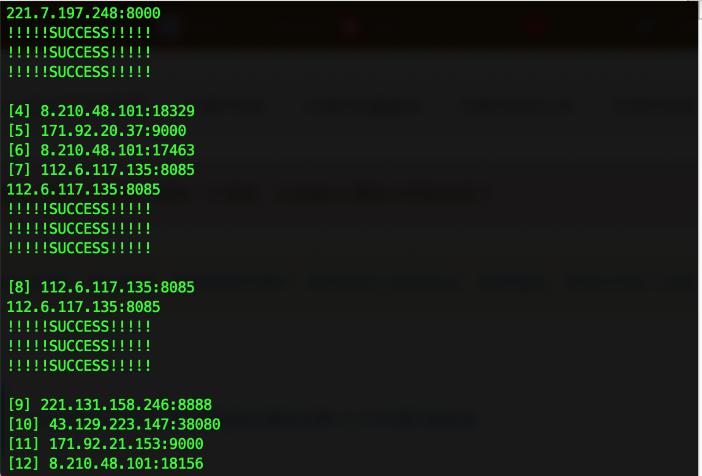

# ip-proxy-filter

## HELP:

### Prior:
chmod +x ./ip_test.sh

### Usage:
`./ip_test.sh <ips.txt> <test_url> [maximum_time] [save_file]`

[test_url] means  the url you want to curl

[test_url] 指你想测试访问的网站

[maximum_time] means  Maximum  time  in  seconds that you allow the whole curl operation to take (Default=2)

[maximum_time] 指访问这个网站在几秒内成功，就把此条代理ip记为可用ip (默认为2秒)

[save_file] means the file you want to save (Default=usable.txt)

[save_file] 指你想将可用ip保存到哪个文件 (默认为usable.txt)

### Warn
if you set [save_file], you'd better set [maximum_time] too.

设置了[save_file] 就需要设置 [maximum_time]

### Example
./ip_test.sh ips.txt https://www.bilibili.com 3 result.txt

